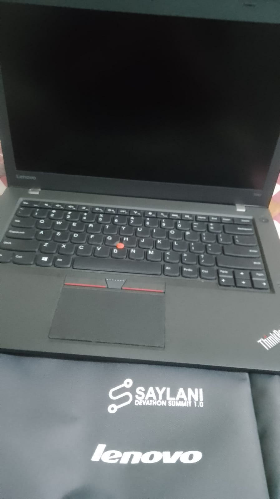

# Web and Mobile Application Development Course Repository

This repository contains the complete projects and folders for my Web and Mobile Application Development course. It includes all the assignments,projects, and code related to the course.

## Contents

- [Description](#description)
- [Certifications](#certifications)
- [Achievements](#achievements)
- [Usage](#usage)
- [Contributing](#contributing)

## Description

This repository serves as a comprehensive collection of all the work done during my Web and Mobile Application Development course. It encompasses both web and mobile application projects, assignments, and related resources.

## Certifications

- Certifications obtained during the course will be listed here.

## Achievements

## Usage

Feel free to browse through the projects and folders. Each project folder contains its respective codebase, documentation, and any additional resources.

## Contributing

Contributions are welcome! If you find any issues or improvements, feel free to open an issue or submit a pull request.

